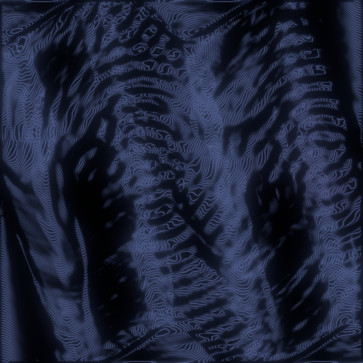

# The orbit trace — the synth draws itself (draft for the docs, step 63)

Every Suzu voice is a state moving in a plane: a cell's (x, y), a lattice's
sum, the rotor's momentum on its torus, and for the strings and the winds
— whose state is a whole chain — the sound against its own slope, the
phase plane of the note. The orbit trace makes that motion visible, two
ways, from the actual trajectory and nothing else: timbre becomes ink
through the state itself, not a proxy.

## The ink route (the one that marbles)

Each video frame, the shell asks the synth for what each traced voice has
drawn since the last frame — the last few milliseconds of orbit, decimated
to a handful of segments by curvature, so the bends get the vertices and a
straight run gets few — and lays it into the water at the note's cell as
tine segments (or wake segments, the stylus doublet), scaled by the orbit's
amplitude. A pure sine stirs a small circle. A shear-distorted orbit combs
its harmonics into the ink. The kicked rotor past its threshold scribbles.
The segments are budgeted like any feed — twenty-four a frame over all
voices, the overflow merged within each voice, never one voice dropped
while another draws — and with the trace off the water is bit-identical to
a world where the trace never existed.

*The kicked rotor, four voices held in Anod while the wheel sweeps K to
2.5: its orbits inked as tines at their cells — the synth drawing its own
phase portrait. The video is in the step's evidence.*

## The scope (the cheap sibling)

The same orbits drawn live, at their cells: on a miniature of the canvas in
the Sound section, held voices bright and released ones dim; and on the
canvas itself, screen-locked in amber over the water — or alone on the
scope's dark glass with the water hidden, the synth's phase portraits and
nothing else, while the water underneath keeps marbling. Non-destructive,
and nothing the dip or the export sees.

## The knobs

Per voice kind (the rotor traces by default), a trace scale in canvas
heights per unit amplitude, four to eight segments a voice a frame, tine or
wake, and a switch for each route — in the Sound section, the settings
file and the preset.
