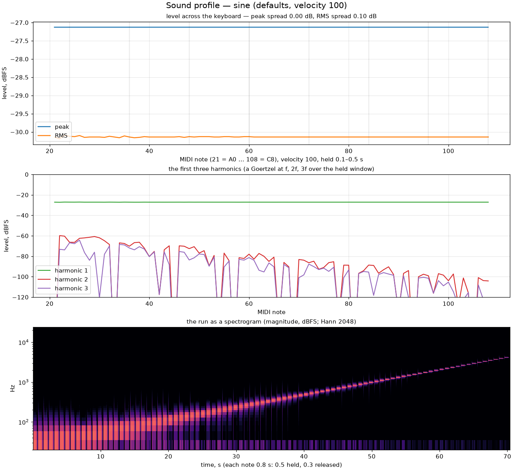
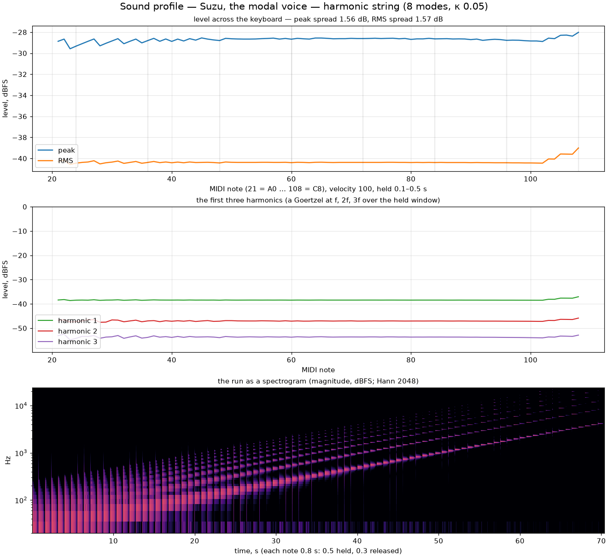
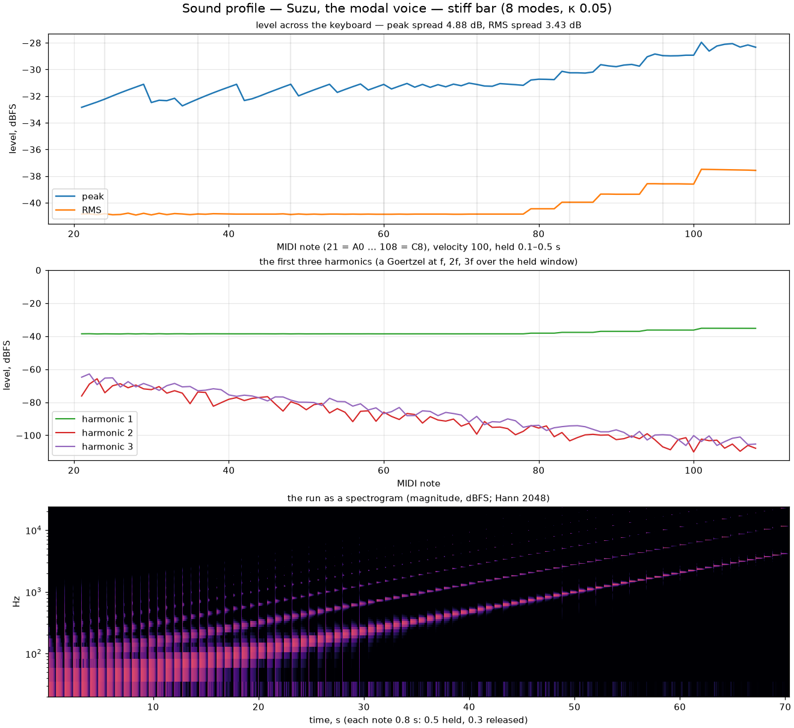
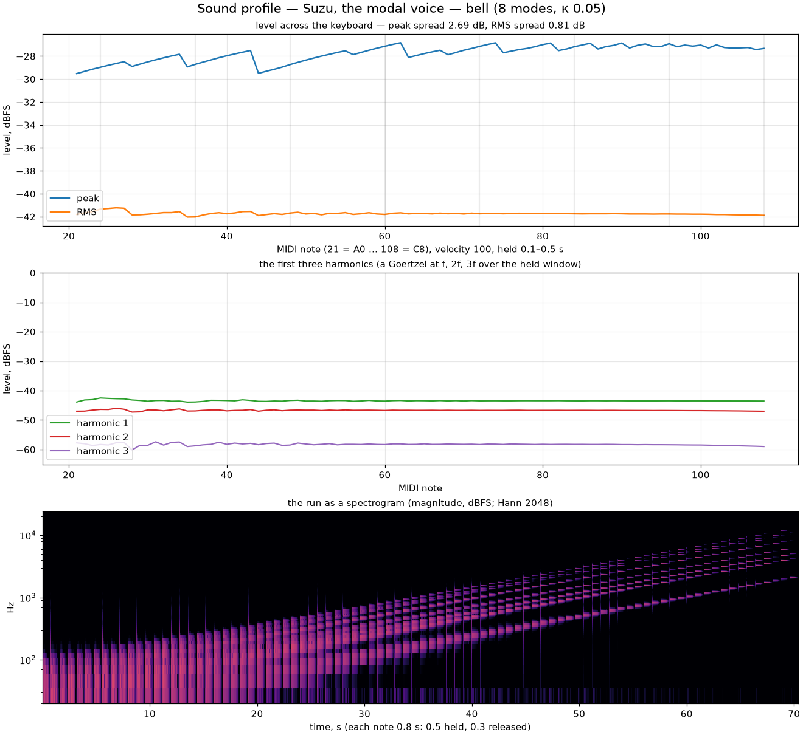
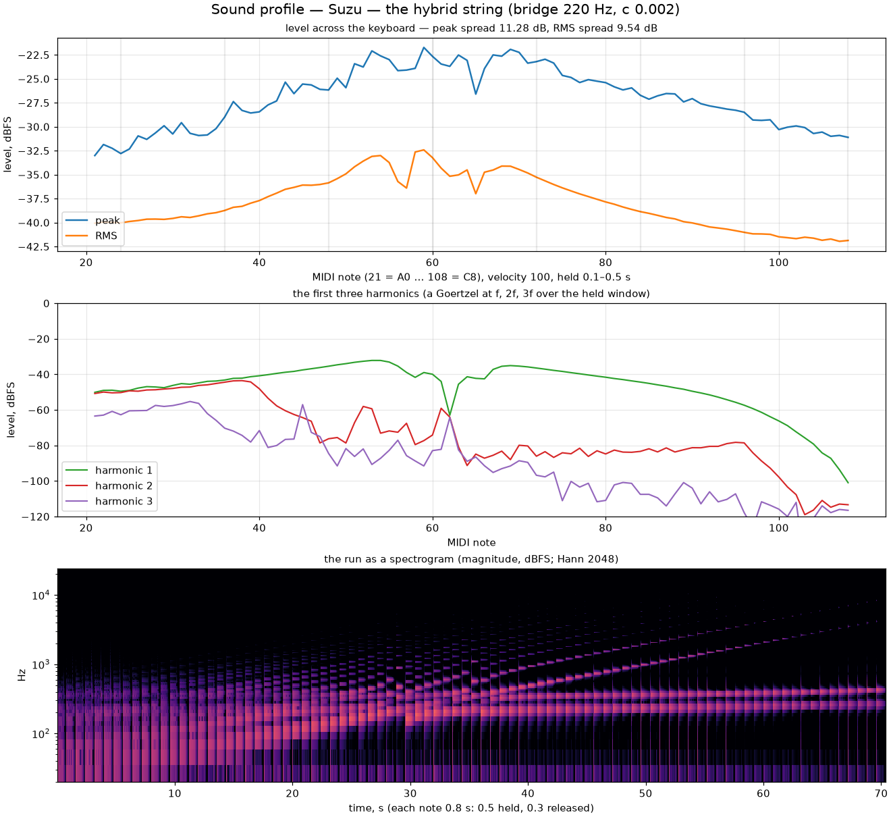
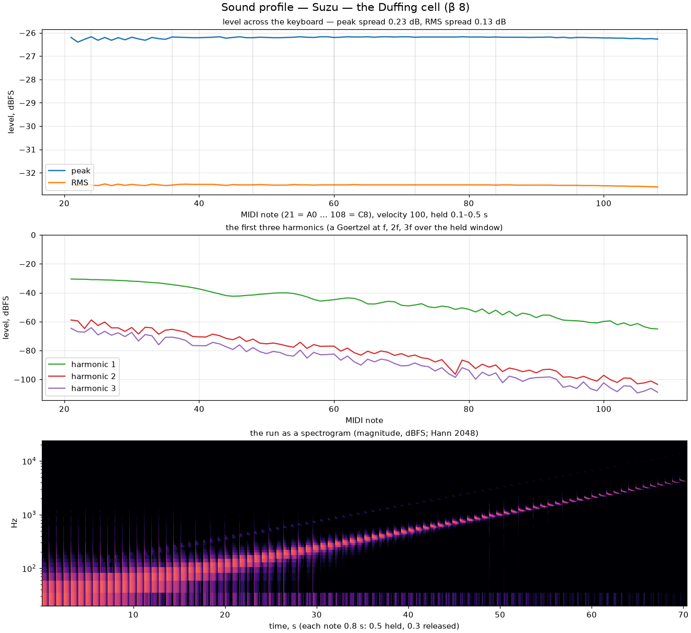
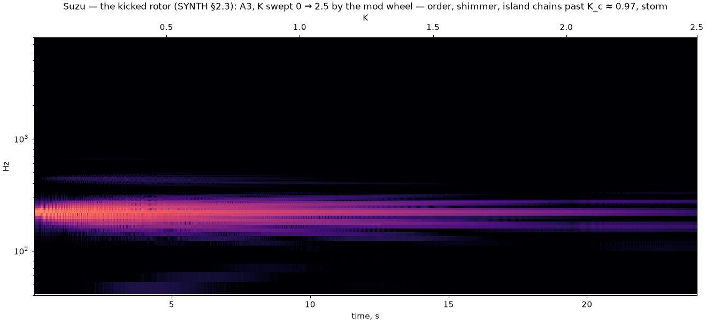
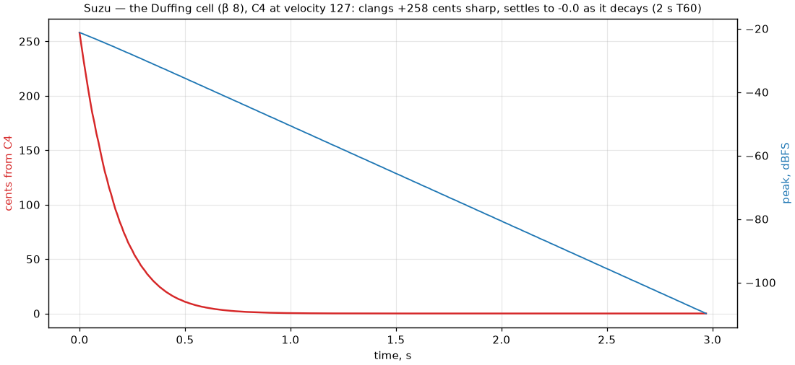
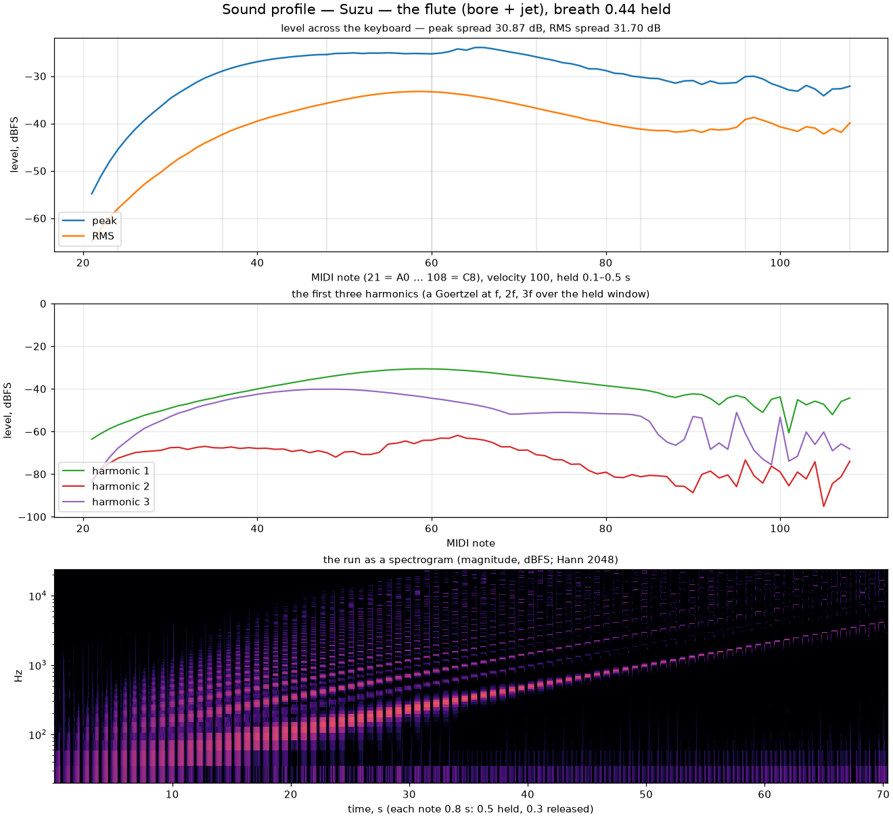

# Suzu — the sound profile (draft for the docs, step 63)

*Drafted at step 56 (`DECISIONS_7 #9`): the graph every synth voice ships
with. The figures beside this file are the evidence's
(`docs/evidence/step56/profile/`, in git history after the fold), regenerated
at any time by `midi-sink --dev --voxo-profile <dir>` and
`tools/sound_profile.py`.*

Each figure strikes every MIDI note from A0 (21) to C8 (108) at velocity 100,
holds it half a second and releases it for three tenths, offline through the
same `voxo_render` the callback runs, and shows three things: the level across
the keyboard (the held window's peak and RMS, dBFS), the first three harmonics
per note, and the run as a spectrogram.

## Suzu, the cells (step 56), the defaults

A magic-circle cell per voice: a pure sine at the same amplitude on every
note — flat to a tenth of a decibel from A0 to C8 — with no harmonics (the
faint second and third are the measurement's own leakage). What a listener
hears vary in the bass is not in the signal: a sine at 30–60 Hz sits where the
ear's equal-loudness curve and a small speaker give little back, and unevenly.

## Suzu with the cubic shear at 0.3

The phase-space shear `x −= ε·(y + s(y))` — an area-preserving map — adds
odd harmonics without moving the level or the pitch: the cell calibrates the
shear's detune at start-up and the voice compensates it, so every note stays
within a fifth of a cent at full gain. A symplectic cubic is a gentle
waveshaper: the third harmonic sits 33 dB under the fundamental here and
23 dB under at full gain; the hard timbres belong to the kicked rotor and the
Duffing cell (step 58).

## The sampler's sine, for reference

## The Dan Tranh demo (the sampler)

Sixteen samples of one articulation stretched across the keyboard: the
library's own profile — the low zones loud, the top faint, a 24 dB spread —
which is what a sampled instrument is, and why a synth's flat line is worth
showing beside it.

## The modal voice (step 57): the five presets

*Eight modes, coupling 0.05, the defaults — `--voxo-suzu-preset <n>`.*

The harmonic string: partials at 1, 2, 3 … with weights 1/k, the highs
decaying first. The second sits 8 dB under the fundamental, the third 14.
Above C7 the upper partials cross the 24 kHz ceiling and are muted — fewer
partials, a little less held energy, and the level line bends by a
decibel.

The free bar's ratios, 1, 2.78, 5.44, 9, 13.4 … : by C4 most of them are
past the ceiling. The 5 dB spread across the keyboard is the instrument's
own — a bar's high notes have fewer partials.

The bell: the hum an octave under the prime, the tierce, the quint, the
nominal and the cluster above (0.5, 1, 1.2, 1.5, 2, 2.5, 2.667, 3). What the
Goertzel calls "harmonic 2" here is the nominal, exactly an octave up. The
peak line's sawtooth is the measurement's: a 0.4 s window catches the
prime–tierce beat (a fifth of the pitch) at a different phase on each note;
the RMS underneath is flat to 0.8 dB.

Glass (1, 2.32, 4.25, 6.63 …, weights 1/m²): nearly a sine with a faint
inharmonic ring.

The plucked string is Karplus–Strong in modal form: partials at
k·√(1 + Bk²), fed by the pluck position in closed form — sin(kπp)/k², the
triangular pluck's spectrum. At p = 0.28 the comb is what you see; pluck at
the middle and the even partials vanish.

## The breath bow

*The harmonic string with breath 0.63 held through every strike.* An
energy servo per mode pulls the orbit toward the breath's target and holds
it: a flat singing line across the keyboard, the second partial level with
the first at bow position 0.3. No breath, no bow — the declared decays
alone, and silence is gated rather than hoped.

## Mode splitting

Two cells at the same pitch, coupled, split into a close pair — the joint
map's normal modes — and the sum beats at their difference. The measured
beat sits on the analytic line to a hundredth of a percent from κ = 0.0125
to 0.5. In a voice with placed ratios the coupling's detune is compensated
so the partials stay where the preset put them; what remains of the
coupling is the exchange of energy between partials — the swirl's job.

## The strings and the chaos voices (step 58)

The Verlet chain: forty-eight masses on springs between fixed ends, plucked
as a triangle and read at a quarter of the length. Its comb is the discrete
string's — the highs compress toward the top mode — and the level is flat
to a decibel and a half. Above C6 the chain sheds nodes to stay under its
stability bound; the pitch is exact by construction at every note.

The hybrid string: a lossless delay line into a bridge of cells, the
output half the string at the pickup and half the bridge's motion — the
body. So the level across the keyboard is the body's response: the notes
around the bridge's two modes (220 and 356 Hz) come out louder, the wolves
sit as dips exactly at them where the string's energy leaves for the
bridge, and the spectrogram shows the two modes ringing across every note.
The top octave also falls by Karplus–Strong's law: the loss is per round
trip, so a high note is short. The fundamental sits on the note everywhere
(0.14 cent); the bridge's pull lives in the partials.

The Duffing cell at velocity 100: a modest clang in the first cycles and
the odd harmonics of its cubic spring.

The kicked rotor at K = 0.3: the island's slow libration puts sidebands
around every note.

## The chaos charts

A3 on the rotor, K swept 0 → 2.5 by the mod wheel: the pure tone, the
libration's sidebands, the band widening toward the octave about the note
past K_c ≈ 0.97 — the visual Chirikov page's sibling, one theorem, two
senses.

C4 struck hard on the Duffing cell (β 8): 258 cents sharp at the strike,
settling onto the note within six tenths of a second while the amplitude
falls along its declared straight line.

A3 on the Duffing cell driven at the note, the press swept 0 → 1: one
partial and its harmonics until a drive of 0.87, then the bifurcation — a
comb of new partials.

## The flute (step 58b)

*The flute at the reference breath (0.44) on every note.* Breath is the
mouth pressure; the embouchure follows the note in this first version (the
jet's delay in periods, its gain with the pitch, its width against it), so
one breath sings the keyboard from C2 to C7 within eight decibels; the
sub-contra octave below a flute's range is quieter still. The chiff is the
jet's noise filtered by the bore.
