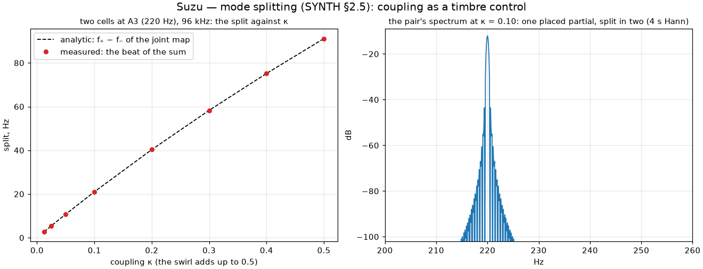

import Lab from "../../../components/Lab.astro";

## A voice is a chain of cells

A Suzu voice is up to sixteen magic-circle cells, each tuned to a ratio of
the note — the *placed* partials — each with a decay it declares, and
coupled to its neighbours by a spring in phase space. Every sample does
three things, in this order: the coupling kick, computed from where every
cell was before the sample began; each cell's own rotation; the declared
damping. Each stage is symplectic, so the chain as a whole neither makes
nor loses energy on its own: a bell with every decay set to zero, struck
once, rings for ten minutes within two thousandths of a decibel.

**Partials, harmonics, overtones.** Partials are whatever frequencies a
voice contains; harmonics are the integer-ratio ones; overtones are the
partials above the fundamental. Here partials arise in exactly three ways:
*placed* by a preset's ratios, *created* by the phase-space shears (the
[cells chapter](../cells/)), and *split* by coupling.

<Lab page="modal" caption="The modal voice, live: each bar a partial's energy placed at its frequency; a strike sets them ringing and each fades at its own rate. Breathe, and the bow feeds each partial toward its target and no further — the servo strip shows the lattice's energy converging. Raise the coupling and the partials exchange energy but stay in tune; the engine refuses a coupling it cannot compensate, saying why." />

## The presets

| preset | ratios | strike weights | what it is | fitted to (VCSL) |
|---|---|---|---|---|
| harmonic string | $k\sqrt{1 + Bk^2}$ | $1/k$ | a string; $B$ its stiffness (0 for nylon) | Concert Harp, acoustic guitars |
| stiff bar | $(2k + 1)^2/9$ — 1, 2.78, 5.44, 9 … | $1/k$ | a free bar | Glockenspiel, marimba, vibraphone |
| bell | 0.5, 1, 1.2, 1.5, 2, 2.5, 2.667, 3 … | as cast, the prime loudest | hum, prime, tierce, quint, nominal … | Tubular Bells 1 & 2, hand bells |
| glass | 1, 2.32, 4.25, 6.63 … | $1/k^2$ | a struck glass | Crotales, glass |
| plucked string | $k\sqrt{1 + Bk^2}$ | $\sin(k\pi p)/k^2$ | Karplus–Strong in modal form; $p$ the pluck position | Dan Tranh (zither), Concert Harp |

The decays follow the string's law: the fundamental's T60 is the patch's,
and each partial above dies faster by a rate that grows with its ratio
squared — highs first. The plucked string's weights are the triangular
pluck's spectrum in closed form: pluck near the bridge and the strike
brightens; pluck at the middle and the even partials are not fed at all.

## Coupling, and why it had to be compensated

The spring between neighbours is a shared potential, so energy migrates
between partials — the physical origin of a soundboard's richness — and
the swirl dimension (poly pressure) adds to it: pull down and hear the
overtones stir. But a spring stiffens each mode it touches. The first
lattice played its fundamental 149 cents sharp at the default coupling
with the swirl down: the coupling knob was a pitch knob before it was a
timbre knob.

So the coupled chain is solved at patch load — its normal modes found, and
each cell's own stiffness adjusted until every normal mode lands on its
ratio — and the voice runs on that, tabled over the coupling's range and
corrected for the pitch it is playing. The partials stay where the preset
put them to a tenth of a cent from C2 to C8 at any coupling the gate
admits, and what remains of the coupling is the exchange of energy.
Splitting survives where it belongs: two cells at the same pitch split
into a close beating pair, exactly the joint map's normal modes.

*Two cells at the same pitch, coupled, split into a close pair and the sum
beats at their difference. The measured beat sits on the analytic line to a
hundredth of a percent from κ = 0.0125 to 0.5.*

## The load gate

A patch is refused at load, with a message, on either of two counts: the
coupling would take a partial's whole spring (the compensation cannot
place it), or the chain's stiffness would reach the sampling bound
somewhere in the playable range — every semitone from A0 to a C8 bent up
four octaves, the modes past the output's Nyquist muted as the voice mutes
them. For every shipped preset the first count binds first; the second is
the chain's ceiling, and its red control lives on two cells just under
that ceiling: five percent over the bound and the harness blows up at
once, five percent under and it rings.

## The breath bow

A cell's damping can be *signed*: below a target orbit the cell is
anti-damped — the bow grips — and above it damped — the bow slips. The
composite is a limit cycle by construction, never free growth: from
silence and from twice the target the orbit settles alike, within a few
time constants, and with no breath there is no bow — the declared decays
alone, and silence is a gated property.

Breath (CC 2, or CC 11) sets the target; the bow's onset sets its time
constant — slow blooms, fast speaks at once — and a bow position says which
partials it feeds. One consequence of the servo's honesty: it can only
inject energy as fast as its onset allows, so a partial whose own decay is
faster than that cannot be held — it rings from the strike and dies. At the
defaults the first three partials of the harmonic string sing; shorten the
onset and more join.

This is the wind player's reason to be here: the instruments that breathe
finally have a voice that holds. On the tablets the *Bowed string* patch is
this voice under the brass layouts' valves and slide.

*The harmonic string with breath 0.63 held through every strike: a flat
singing line across the keyboard, the second partial level with the first
at bow position 0.3.*

## The profiles

The harmonic string: partials at 1, 2, 3 … with weights $1/k$, the highs
decaying first. Above C7 the upper partials cross the 24 kHz ceiling and are
muted — fewer partials, a little less held energy, and the level line bends
by a decibel.

The bell: the hum an octave under the prime, the tierce, the quint, the
nominal and the cluster above. The peak line's sawtooth is the measurement's
— a 0.4 s window catches the prime–tierce beat at a different phase on each
note; the RMS underneath is flat to 0.8 dB. The bar, the glass and the
plucked string are on the [profiles page](../sound-profile/).
