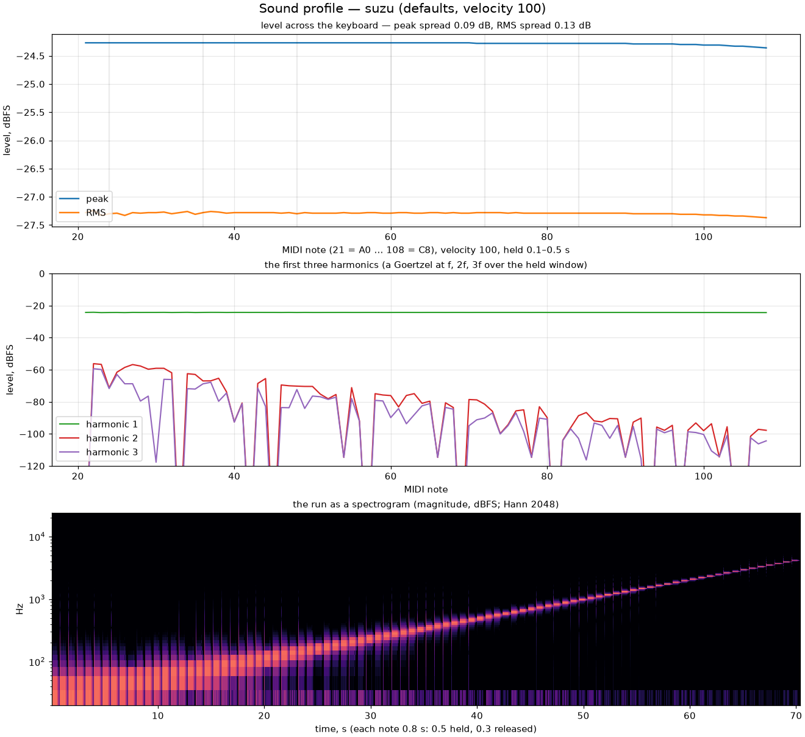
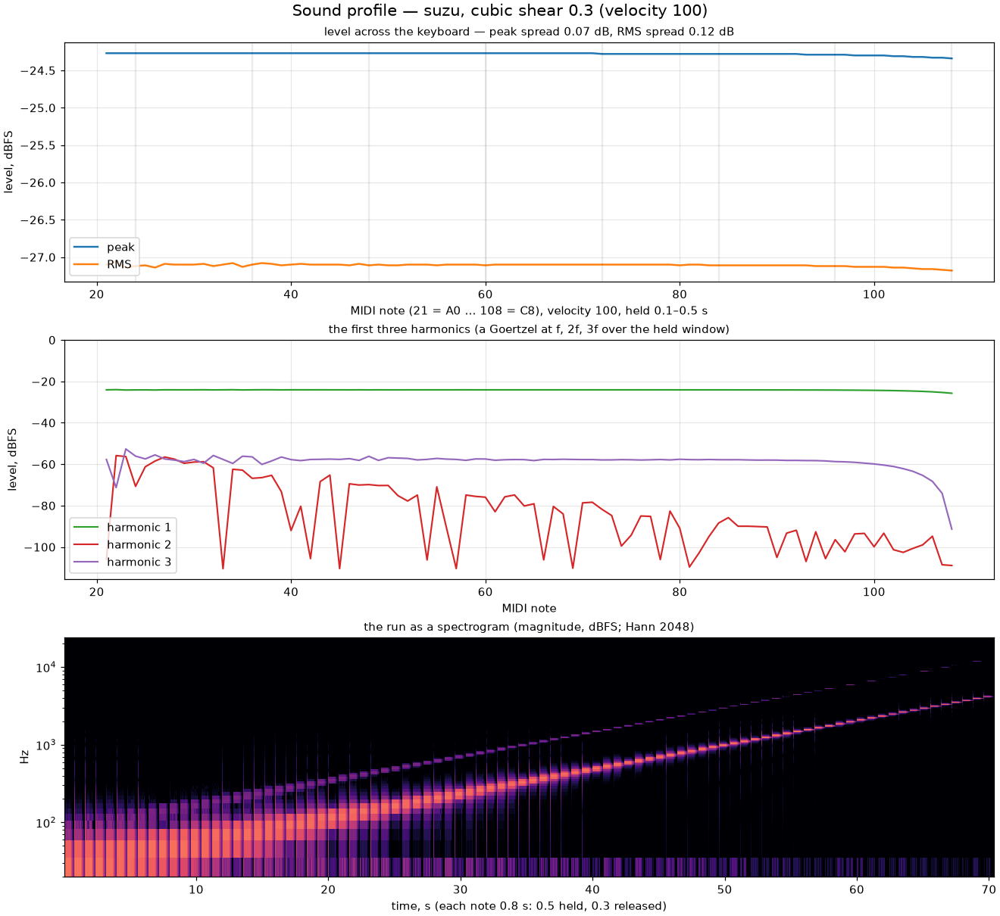
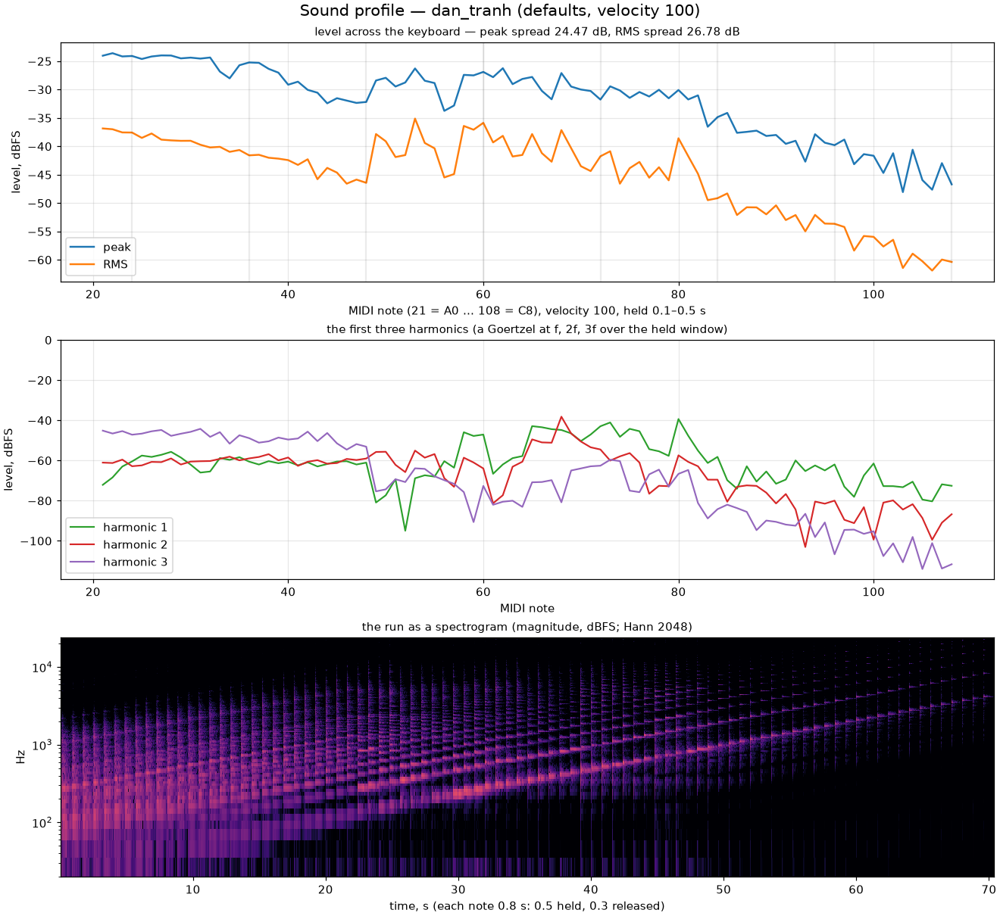
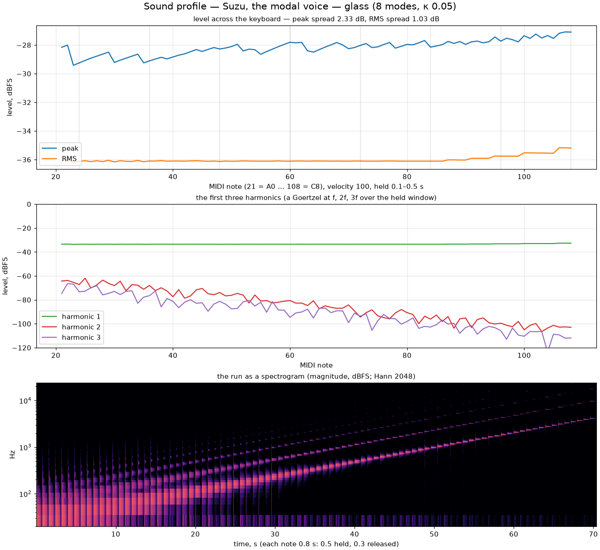
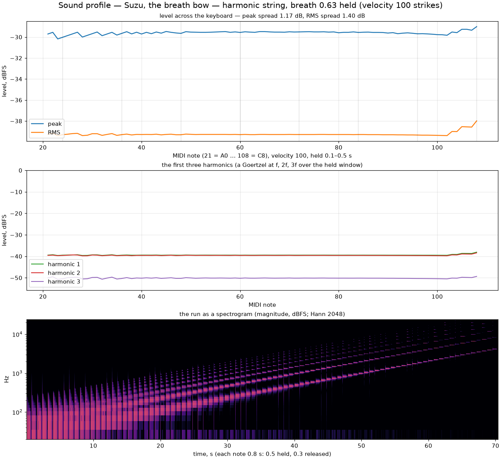
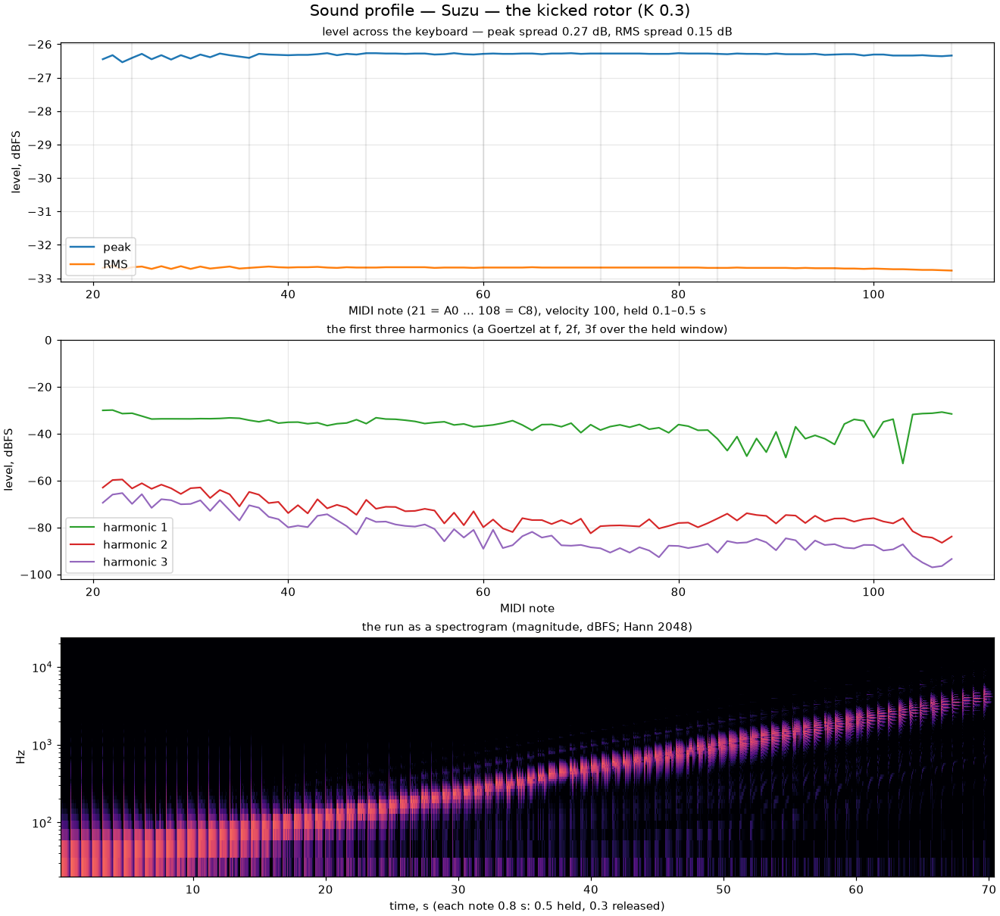
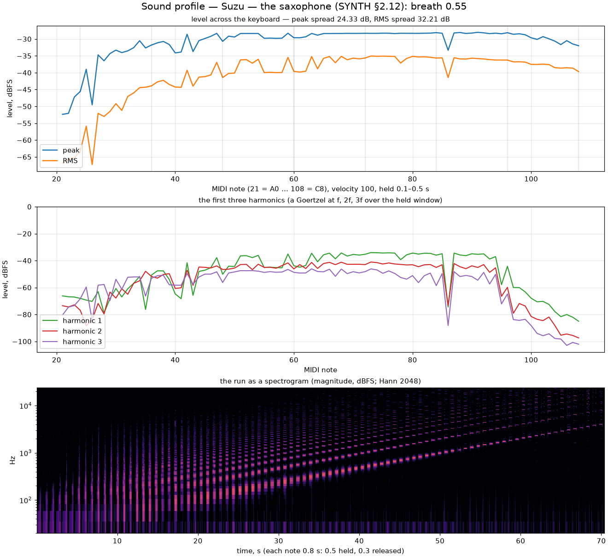
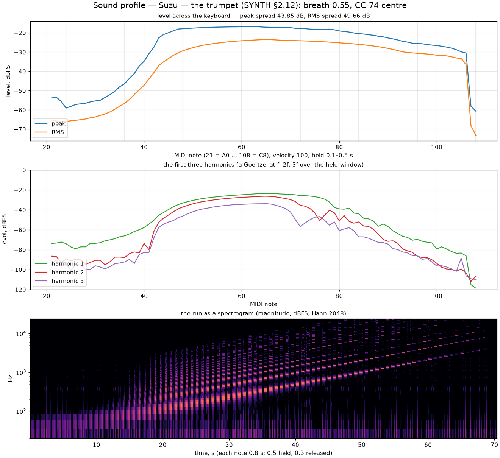

Every synth voice ships with its sound profile; it is the author's rule,
and the figure goes into each step's evidence before the voice is called
done. Each figure strikes every MIDI note from A0 (21) to C8 (108) at
velocity 100, holds it half a second and releases it for three tenths,
offline through the same `voxo_render` the callback runs, and shows three
things: the level across the keyboard (the held window's peak and RMS,
dBFS), the first three harmonics per note, and the run as a spectrogram.
The desktop bench regenerates any of them: `midi-sink --dev --voxo-profile
<dir>` with `--voxo-suzu-voice <kind>` or `--voxo-suzu-preset <n>`, then
`tools/sound_profile.py`.

Every voice profiled here can be played in the [Suzu lab](../lab/), the
engine itself in the browser.

## The cells

A magic-circle cell per voice: a pure sine at the same amplitude on every
note — flat to a tenth of a decibel from A0 to C8 — with no harmonics (the
faint second and third are the measurement's own leakage). What a listener
hears vary in the bass is not in the signal: a sine at 30–60 Hz sits where
the ear's equal-loudness curve and a small speaker give little back, and
unevenly.

The phase-space shear at 0.3 — an area-preserving map — adds odd harmonics
without moving the level or the pitch: the cell calibrates the shear's
detune at start-up and compensates it, so every note stays within a fifth
of a cent at full gain. The third harmonic sits 33 dB under the fundamental
here and 23 dB under at full gain.

## The sampler, for reference

The sampler's own sine, and the Dan Tranh demo: sixteen samples of one
articulation stretched across the keyboard — the library's own profile, the
low zones loud, the top faint, a 24 dB spread — which is what a sampled
instrument is, and why a synth's flat line is worth showing beside it.

## The modal voice: the five presets

*Eight modes, coupling 0.05, the defaults.*

The harmonic string: partials at 1, 2, 3 … with weights 1/k, the highs
decaying first. The second sits 8 dB under the fundamental, the third 14.
Above C7 the upper partials cross the 24 kHz ceiling and are muted.

The free bar's ratios, 1, 2.78, 5.44, 9, 13.4 …: by C4 most of them are
past the ceiling. The 5 dB spread across the keyboard is the instrument's
own — a bar's high notes have fewer partials.

The bell: the hum an octave under the prime, the tierce, the quint, the
nominal and the cluster above. What the harmonic tracker calls "harmonic 2"
here is the nominal, exactly an octave up; the peak line's sawtooth is the
measurement's own, the RMS underneath flat to 0.8 dB.

Glass (1, 2.32, 4.25, 6.63 …, weights 1/m²): nearly a sine with a faint
inharmonic ring.

The plucked string, Karplus–Strong in modal form: partials at k·√(1 + Bk²),
fed by the pluck position in closed form — sin(kπp)/k², the triangular
pluck's spectrum. At p = 0.28 the comb is what you see; pluck at the middle
and the even partials vanish.

The breath bow on the harmonic string, breath 0.63 held through every
strike: a flat singing line across the keyboard.

## The strings and the chaos voices

The Verlet chain's comb (the highs compressed toward the top mode, the
level flat to a decibel and a half), the hybrid string's body response
(louder around the bridge's two modes at 220 and 356 Hz, the wolves as dips
exactly there), the Duffing cell's clang and odd harmonics, and the rotor at
K = 0.3 with the island's sidebands. The chapter:
[strings and chaos](../strings-and-chaos/).

## The winds

The flute at the reference breath (one breath sings C2 to C7 within eight
decibels), the saxophone at breath 0.55 (C2 to C7 within six, the first
register everywhere, the bore running out of cells below C2), and the
trumpet (C3 to C6 within a decibel, the bass falling away below C3 where
the bore wants three times the cells the cap allows — the trumpet's range,
as a trumpet's is). The chapter: [winds](../winds/).
