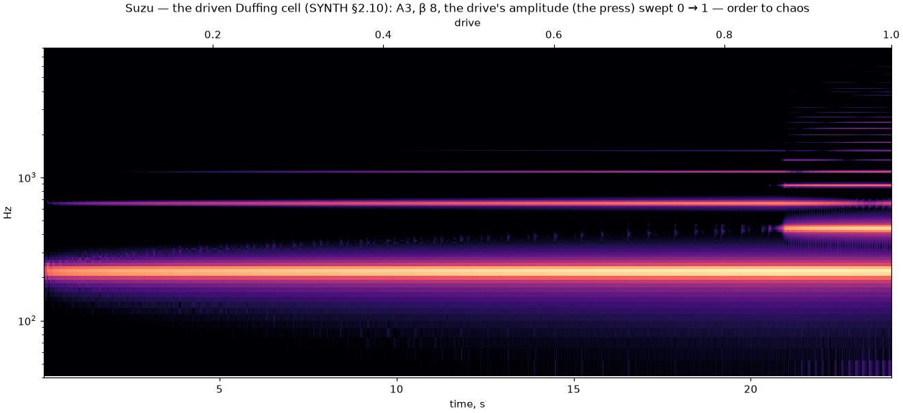

import Lab from "../../../components/Lab.astro";

## The Verlet chain

Where the modal voice gives a string's *spectrum*, the chain gives its
*body*: masses on springs between two fixed ends, every acceleration read
from where the neighbours were before the sample began, then velocity, then
position — symplectic Euler with a damping each node declares. The scheme
has a ceiling: the top mode must stay under Nyquist, which is the CFL
bound $k\,dt^2 \le 1$. Tuning couples the node count, the stiffness and the
sample rate, so a note is given as many nodes as the bound allows (48 up to
C6, ten at C8) and the stiffness re-derived — the pitch is then exact at
every note. A patch that forces the stiffness past the bound is refused at
load; with the gate bypassed the harness blows up in twenty-five samples,
and that run is archived. Pluck a ringing string and the new triangle is
added to what is still moving. Cost is honest: nodes × rate × voices.

## The hybrid string

The high-yield architecture: a lossless delay line carries the travelling
wave into a bridge of two or three cells — the body's resonances — through
a junction stated as an algorithm. The wave arriving at the bridge is a
force on it; the bridge's own motion radiates back into the string; the
reflection leaves for the far end, inverts there, and returns. Written
carelessly, such a junction makes energy: the first two forms tried went to
infinity in seconds. Written on the cell's velocity at the position's time
level and with the midpoint rule, its ledger balances exactly per sample:
with every declared loss set to zero the loop rings for ten minutes within
two hundredths of a decibel.

A bridge pulls the string's pitch — up to a semitone near its own
resonance, the wolf. The junction is linear, so its reflection phase at the
note is solved in closed form when the string is tuned and folded into the
delay line's fraction (a Thiran allpass): the fundamental sits on the note
everywhere, and the pull stays in the partials, where the body belongs.

Passivity is gated twice. At patch load the closed loop is simulated for
three hundred round trips with every declared damping zeroed, and a patch
whose junction gains is refused with a message — no patch can dodge it. And
the ten-minute soak above. The reflection's gain is a lab knob whose
conserving value is exactly one; five percent over it, with the probe
bypassed, the loop goes non-finite in half a minute.

Karplus–Strong's averaging filter is here as a declared loss, a one-zero
with gain at most one. Its loss is per round trip, so a high note is short
in seconds — as on a real string.

<Lab page="strings" caption="Three strings side by side — the chain, the hybrid and the modal pluck — each drawn from the engine's own state. The hybrid's body rings beside the string: its bridge modes are part of its tone. The lab mode's red control pushes the chain's stiffness past the stability bound: the engine refuses the patch, and with the refusal bypassed the chain blows up at once." />

## The Duffing cell

The magic circle with a hardening spring: the kick reads $x + \beta x^3$. It
is still symplectic — a shear of one coordinate by a function of the other
— and its pitch depends on its amplitude: struck hard, C4 clangs two and a
half semitones sharp and settles onto the note within six tenths of a
second as its declared decay shrinks the orbit, a gesture no wavetable
owns. The settled pitch needs no compensation: the cubic vanishes with the
orbit. Driven by a sinusoid whose amplitude is the press, it is the second
chaos voice: at a drive of 0.87 the single partial bifurcates into a comb.

*C4 struck hard on the Duffing cell (β 8): 258 cents sharp at the strike,
settling onto the note within six tenths of a second while the amplitude
falls along its declared straight line.*

*A3 driven at the note, the press swept 0 → 1: one partial and its harmonics
until a drive of 0.87, then the bifurcation — a comb of new partials.*

## The kicked rotor

[Chirikov's standard map](../../operators/chirikov/) as an oscillator. The
cell carries the angle; once per cycle of the note the momentum is kicked
by $K\sin\theta$ and wrapped onto its torus, and the momentum *is* the
pitch, within the octave about the note — the cell re-based onto
$f_0(1 + p/2\pi)$, never a jump. $K = 0$ is the pure tone. Small $K$: the
momentum breathes slowly round an island and the tone shimmers with orderly
sidebands. Near $K_c \approx 0.9716$ the last invariant torus breaks; past
it the momentum diffuses across the band and the tone is pitched noise
that still remembers its fundamental. The mod wheel sweeps $K$ — the
patch's *rotor K* up to 2.5 — smoothed over 20 ms so its steps never land
as jumps: the same controller can tear the water on the Chirikov canvas and
the tone at once. One theorem, two senses.

*A3 on the rotor, K swept 0 → 2.5 by the mod wheel: the pure tone, the
libration's sidebands, the band widening toward the octave about the note
past the threshold.*

<Lab page="chaos" caption="Duffing and the kicked rotor, live. The rotor's section: one dot per kick, the angle across and the momentum up. Turn the mod wheel — below the threshold the dots lie on curves and the momentum stays inside its island; past it they fill a chaotic sea and the pitch wanders with them. The Duffing cell beside it: struck hard, it clangs sharp and settles onto the note." />

## The chaotic modulator

A double pendulum at control rate, its energy set by each strike's
velocity: a soft note swings, a hard one tumbles chaotically. Its output
is bounded by construction and routed to one smoothed parameter — the
cutoff, the coupling, the rotor's $K$ or the drive — as the patch's organic
drift. The spec asked for a leapfrog; the double pendulum's Hamiltonian is
not separable and a leapfrog is not symplectic for it (it drifted to
nonsense in minutes), so the integrator is RK4 with the energy projected
back to the trigger's value after each step — a correction that measures as
a no-op and bounds by construction: the *projected* class.

## Both at once

The sampler and Suzu can sound together: on the *layered* source every note
strikes a sampled voice and a synth body in the same voice. That is how the
combined stress runs — the fifteen-channel storm with a heavy piano library
under the Verlet chain, twelve voices, no dropouts.

## The profiles

The Verlet chain: forty-eight masses on springs between fixed ends, plucked
as a triangle and read at a quarter of the length. Its comb is the discrete
string's — the highs compress toward the top mode — and the level is flat
to a decibel and a half. Above C6 the chain sheds nodes to stay under its
stability bound; the pitch is exact by construction at every note.

The hybrid string: the output half the string at the pickup and half the
bridge's motion — the body. So the level across the keyboard is the body's
response: the notes around the bridge's two modes (220 and 356 Hz) come out
louder, the wolves sit as dips exactly at them where the string's energy
leaves for the bridge, and the top octave falls by Karplus–Strong's law.
The fundamental sits on the note everywhere (0.14 cent).

The Duffing cell at velocity 100 — a modest clang in the first cycles and
the odd harmonics of its cubic spring — and the kicked rotor at K = 0.3,
the island's slow libration putting sidebands around every note.
