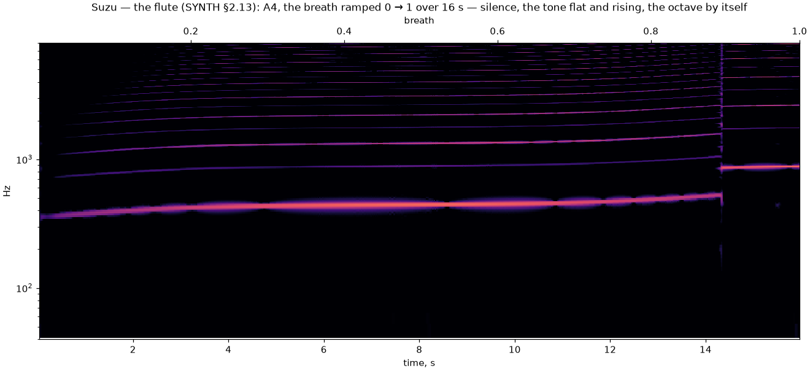
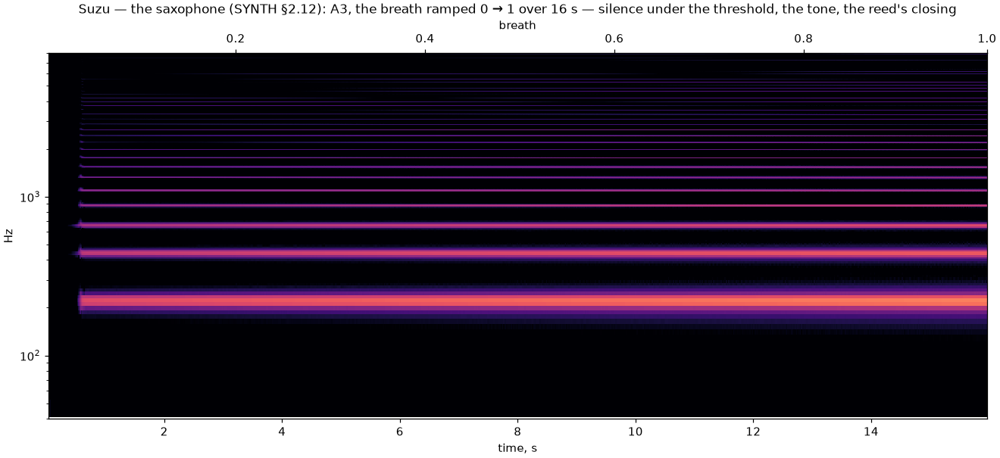
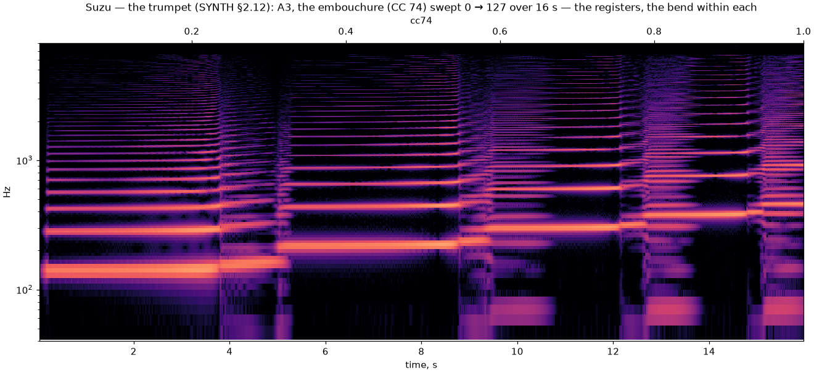

import Lab from "../../../components/Lab.astro";

## The flute: a bore and a jet

The first wind. The bore is the chain again, wearing acoustic variables:
pressure at the nodes, volume velocity between them, the cross-section as
a weight per node, the same symplectic Euler and the same stability
ceiling — derived from the grid, gated at load, its red control archived.
Pitch is the bore's length: a note gets as many cells as its wavelength
needs and the Courant number absorbs the fraction. Three geometries were
measured against theory: a closed-open cylinder peaks at the odd
harmonics, an open-open one at all integers, and a cone closed at its
apex at all integers too — the saxophone's series, the conical result, real.
The ends are declared ports where the sound leaves, their loss rising with
frequency as a real open pipe's does; their reactance is an end correction,
and the tuning counts it.

The jet has no moving parts. The air leaving the flue is carried by the
acoustic displacement there, travels to the labium in a time set by the
blowing pressure, grows on the way — best around one frequency that rises
with the jet's speed — and the labium splits the flow: inside or out, a
tanh. The rate of that split is a pressure across the labium, and that
pressure is the bore's port. It can never do more work on the bore in a
sample than the mouth does on the jet: **the mouth-power ledger holds by
arithmetic** — the energy the bore holds stays under ∫P·Q dt, the jet's
stored energy ≤ 0.06 % of it over a phrase.

Breath is the mouth: CC 2, or the press when the patch lets it blow. No
breath, no tone.

Nothing here is programmed to overblow. Raise the breath and the jet's
travel time shortens until the phase no longer favours the fundamental;
the loop bifurcates to the octave on its own. Blow softly and the tone
sits flat — the jet's phase lag, for free.

*A4, the breath ramped 0 → 1 over sixteen seconds: silence, a flat whisper,
the note, sharp, and the octave by itself — within 7 cents, on the desktop
and in Chrome.*

<Lab page="flute" caption="The flute, live. Hold a note and raise the breath: the tube is the bore, its pressure swinging inside a half-sine envelope — the first register. The jet leaves the flue at the left and swings across the labium's edge. Blow harder and past a point the second mode takes over, the envelope grows a node in the middle, and the flute sounds the octave. The strip chart follows the sounding pitch against the breath; soft blowing visibly flattens it." />

## The saxophone and the trumpet: a reed and a pair of lips

The other two winds have a moving part. The valve is one cell — a mass on
a spring under the pressure difference between the mouth and the
mouthpiece — and the two instruments are the two ways it can face: the
reed closes when the mouth pushes harder, the lips open. Air passes the
aperture as Bernoulli says it must, as the square root of the pressure
across it, and here is the hard part: the pressure across the aperture is
the one the bore has *after* the flow arrives, so the flow is the root of a
quadratic solved against the bore's own one-step impedance, exactly, every
sub-step. The naive alternative — take the pressure from the step before —
is the archived red control: it runs finite on a steady blow and goes
non-finite the moment a transient hits it. So the patch is probed when it
loads, twice, with the bore's losses zeroed and a retune halfway, and the
mouth-power ledger is asserted: the energy in the bore and the valve
together never exceeds the work the mouth has done (E ≤ 1.05·∫P·Q at 30 ms;
the naive junction reads $10^{300}$×). The valve's own swept volume and
its own energy are in that sum; the ledger caught the sign of the first and
the form of the second before a note was heard.

**The saxophone** is a cone closed at its truncated apex, and the
truncation is where the instrument lives. A cone cut deeply has a weak
first peak — the third is three times it — and a reed does what a reed
does: it takes the strongest peak, and the sax played its third register
with a slow modulation at the note that every pitch estimator read as a
wandering fundamental. Cut at a quarter, with a mouthpiece holding the
volume of the missing apex (Benade's rule, which puts the peaks back on the
integers), the first peak stands within a factor two of the second and the
first register holds — on every note, because the sax scales with the note
as the flute's embouchure does: its bell's cutoff and its wall loss are
declared at A3 and follow the pitch, so C6 is the A3 horn in miniature.
The reed is quasi-static, a stiffness with a stop at the lay. Its pull on
the pitch is measured when the patch loads — four notes blown, the period
of each against the note — and the bore is cut to cancel it. Breath is the
mouth pressure, from the reed's threshold at a light breath to six tenths
of its closing pressure, and the level follows the breath — a beating
reed's own amplitude barely grows, so the crescendo is declared. The sax's
spectacle is that it does not overblow; A3 keeps a quasi-periodic beat in
its tone, the author's accepted character.

**The trumpet** is a cylinder with a flare, and its registers are the
player's lips. The note sits on the bore's third peak — a flared bore's
peaks are not a harmonic series from its length, so they are measured when
the patch loads — and the lips' resonance sits just under it (an outward
valve plays above its resonance). CC 74 is the embouchure: it bends the
lips an octave either way, and the trumpet steps down to the peak below at
one end and up to the octave at the other, bending within each register as
the lips pull it — the staircase in the chart, with the pedal showing
through where the lips cross between peaks. The brass is a declared shear
on the outgoing wave at the bell, amplitude-driven; the shock itself stays
deferred. On the tablets the *Trumpet* patch sounds under the
[trumpet layout's](../../guide/instruments/) valves, the engine's own
fingering choosing the partial and the lips following CC 74.

<Lab page="winds" caption="The saxophone and the trumpet, live. The tube shows the standing wave — for the cone, the pressure times the distance from the apex, the part that stands as a sine. At the left the valve opens and closes; beside it its portrait, the reed's displacement against its velocity. The ledger is the energy budget: the mouth's work against the energy the bore and the valve hold, and the held energy never exceeds the work. The lab mode's red control makes the junction the naive way; bypass the refusal, bend the note, and the ledger's line is crossed until the samples are no longer numbers." />

## The profiles

The flute at the reference breath (0.44) on every note: the embouchure
follows the note (the jet's delay in periods, its gain with the pitch, its
width against it), so one breath sings the keyboard from C2 to C7 within
eight decibels. The chiff is the jet's noise filtered by the bore.

The saxophone at breath 0.55: C2 to C7 within six decibels at half breath,
the first register everywhere. Below C2 the bore runs out of cells and the
level thins: the sax's range.

The trumpet at breath 0.55, CC 74 at centre: C3 to C6 within a decibel, C7
nine down. Below C3 the bore wants three times the cells the cap allows
(its own fundamental is the note's third) and the bass falls away — the
trumpet's range, as a trumpet's is.
